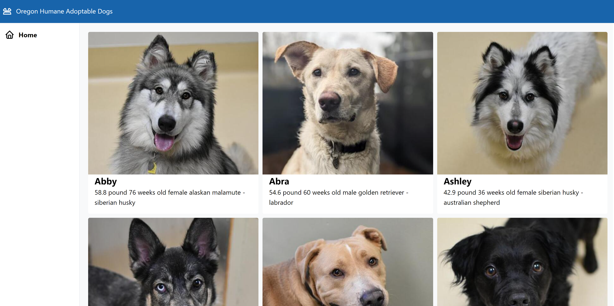

## 
Oregon-Humane-Adoptable-Dogs


Screenshot

# About
Followed along with a tutorial project to better understand the tech stack.
Tutorial by Jack Herrington: https://www.youtube.com/watch?v=XzE-PzALyDc

# Tech Stack
Next.js
React
Typescript
GraphQL
Apollo


## Check it out

Clone the repo/Download the code.
Run the development server:

```bash
npm run dev
# or
yarn dev
```

Open [http://localhost:3000](http://localhost:3000) with your browser to see the result.